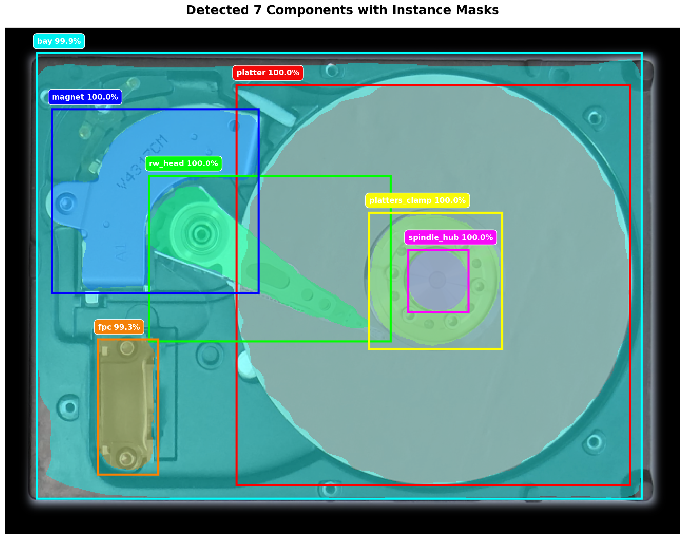

# Component Segmentation for Hard Drive Disassembly

A visual intelligence system for automated hard drive disassembly using Mask R-CNN with MobileNetV1 backbone for instance segmentation of hard drive components.

## 📄 Publication

This work is based on the research paper:

**"A Visual Intelligence Scheme for Hard Drive Disassembly in Automated Recycling Routines"**  
*Robovis 2020 - International Conference on Robotics, Vision and Intelligent Systems*  
Budapest, Hungary, November 2020  
DOI: [10.5220/0010016000170027](https://doi.org/10.5220/0010016000170027)

### Model Selection

This implementation uses **MobileNetV1-RCNN** (MobV1-RCNN), which was selected after evaluating multiple state-of-the-art architectures:
- MobileNetV1, MobileNetV2
- Cascade-RCNN
- Native Mask-RCNN
- Cascade-MobileNetV1

**Key findings from the paper:**
- MobV1-RCNN achieved **0.78 AP** (Average Precision) on COCO metrics
- Cascade-RCNN achieved highest accuracy (0.84 AP) but was unstable at high resolutions
- MobV1-RCNN was selected for its stability with high-resolution images and lighter model size
- Trained for 500 epochs using TensorFlow with data augmentation

The model detects and segments 12 different hard drive component types with high accuracy, making it suitable for automated recycling and disassembly workflows.

## � Authors

**Erenus Yildiz** (Lead Author, Implementation)  
Email: erenus.yildiz@hotmail.com

**Co-authors:**  
Tobias Brinker, Erwan Renaudo, Jakob J. Hollenstein, Simon Haller-Seeber, Justus H. Piater, Florentin Wörgötter

---

## About This Repository

This repository contains a standalone Python implementation for running
component segmentation using the trained Mask R-CNN model. The original project shipped
with ROS integration and extensive bookkeeping utilities. Those dependencies
have been removed in favour of a lightweight script that consumes an image and
produces a segmentation mask.

## Demo



The model detects and segments 12 different hard drive component types including platters, PCB, magnets, read/write heads, spindle hub, and more. Each detected component is shown with:
- **Colored semi-transparent mask** (40% opacity) showing the exact pixels belonging to that component
- **Bounding box** in the same color outlining the component region
- **Label** with component name and confidence score (typically >99% for correctly detected parts)

The segmentation uses IoU (Intersection over Union) metric for accuracy evaluation, achieving 0.78 AP on the test dataset.

## Getting started

1. **Install dependencies**

   Create and activate a virtual environment, then install the Python
   dependencies:

   ```bash
   python3 -m venv .venv
   source .venv/bin/activate
   pip install -r requirements.txt
   ```

   **Note**: This project requires Python 3.10+ with modern dependencies (TensorFlow 2.11, Keras 2.11).

   The repository vendors the Mask R-CNN implementation so no additional
   packages are required beyond the list above.

2. **Download the pre-trained weights**

   Download the `model.h5` file from
   [Google Drive](https://drive.google.com/file/d/1wj0FzDZ_niXflA38LqRaNpd0OQkt1HAe/view?usp=sharing)
   and place it in the `models/` directory:
   
   ```bash
   mkdir -p models
   # Place downloaded model.h5 in models/
   ```

3. **Run inference**

   **Recommended - Visual output with masks and labels:**
   ```bash
   # Place your input image in assets/input.png, then run:
   python scripts/visualize.py assets/input.png assets/output.png
   ```
   
   This creates a visualization showing:
   - Original image with semi-transparent colored masks for each detected component
   - Bounding boxes around each component
   - Labels with component names and confidence scores
   - Console output with detailed detection statistics
   
   Example output:
   ```
   Detected 7 components:
     1. platter: bbox=(219,54,592,433) size=373x379 mask_pixels=111,676 conf=100.00%
     2. rw_head: bbox=(136,140,365,297) size=229x157 mask_pixels=9,387 conf=99.99%
     3. magnet: bbox=(44,77,240,251) size=196x174 mask_pixels=16,470 conf=99.98%
     ...
   ```

   **Raw mask extraction (for programmatic use):**
   ```bash
   python component.py --weights models/model.h5 --image /path/to/input.jpg \
       --output /path/to/output_mask.png
   ```
   
   **Note**: Raw masks use grayscale values (0-11) representing class IDs, which appear nearly black when viewed directly. Use `visualize.py` for human-readable output.

   If the `--output` argument is omitted the script will default to writing a
   PNG file next to the input image whose name ends with `_mask.png`.  Masks can
   alternatively be saved as NumPy arrays by using a path that ends with
   `.npy`.

## Python API

The `ComponentSegmenter` class exposes the same functionality programmatically:

```python
from component import ComponentSegmenter, CLASS_NAMES

segmenter = ComponentSegmenter("models/model.h5")
result, mask = segmenter.segment_image_path("/path/to/input.jpg")

# Access detection results
print(f"Detected {len(result.class_ids)} components")
for i, (class_id, score, roi) in enumerate(zip(result.class_ids, result.scores, result.rois)):
    class_name = CLASS_NAMES[class_id]
    y1, x1, y2, x2 = roi
    print(f"  {i+1}. {class_name}: {score:.2%} confidence at ({x1},{y1},{x2},{y2})")

# Access per-instance masks (if needed)
if result.masks is not None:
    for i in range(result.masks.shape[2]):
        instance_mask = result.masks[:, :, i]  # Binary mask for this instance
        pixel_count = instance_mask.sum()
        print(f"    Instance {i+1} has {pixel_count} pixels")
```

The returned `mask` is a two-dimensional `numpy.ndarray` whose values correspond
to class indices in `CLASS_NAMES`. The `result.masks` contains per-instance binary masks
as a 3D array of shape `(height, width, num_instances)`.

## Visualization Tool

The `scripts/visualize.py` script provides rich visualization of segmentation results:

**Features:**
- 🎨 Each component gets a unique color (red, green, blue, yellow, etc.)
- 🔍 Semi-transparent masks (40% opacity) show exact component boundaries
- 📦 Bounding boxes outline each detected component
- 🏷️ Labels display component name and confidence score
- 📊 Console output provides detailed statistics (bbox coordinates, mask pixel counts)

**Usage:**
```bash
python scripts/visualize.py [input_image] [output_image]

# Examples:
python scripts/visualize.py assets/input.png assets/output.png
python scripts/visualize.py my_hdd.jpg results/segmented.png
```

If no arguments provided, defaults to `assets/input.png` → `assets/output.png`.

**Understanding the output:**
- Overlapping components will show blended colors (e.g., yellow + blue = cyan)
- Larger components like "bay" may cover most of the image
- Each instance mask shows exactly which pixels belong to that component
- The final merged mask (printed in statistics) may show fewer classes due to overlap resolution

## Component Classes

The model can detect and segment 12 different hard drive component types:

| ID | Class Name | Description |
|----|------------|-------------|
| 0 | BG | Background |
| 1 | magnet | Voice coil magnets |
| 2 | fpc | Flexible Printed Circuit |
| 3 | rw_head | Read/Write head assembly |
| 4 | spindle_hub | Spindle motor hub |
| 5 | platters_clamp | Platter retaining clamp |
| 6 | platter | Storage platters/disks |
| 7 | bay | Drive bay/enclosure |
| 8 | lid | Top cover |
| 9 | pcb | Printed Circuit Board |
| 10 | head_contacts | Head connector contacts |
| 11 | top_dumper | Top damper |

These components were identified as critical for automated disassembly workflows in electronics recycling.

## Technical Details

### Architecture
- **Backbone**: MobileNetV1 (depthwise separable convolutions for efficiency)
- **Framework**: Mask R-CNN for instance segmentation
- **Input**: High-resolution RGB images of hard drive components
- **Output**: Per-instance binary masks + bounding boxes + class labels + confidence scores

### Training
- **Epochs**: 500
- **Framework**: TensorFlow 1.15.2 (original), migrated to TensorFlow 2.11
- **Platform**: Google Colaboratory (original training)
- **Data Augmentation**: Standard Mask-RCNN augmentation procedures
- **Metric**: COCO Average Precision (AP) with IoU thresholds

### Performance
- **AP Score**: 0.78 (MobileNetV1-RCNN)
- **Inference**: Real-time capable on GPU (RTX 3090 tested)
- **Stability**: High - handles high-resolution images consistently
- **Typical Confidence**: >99% for correctly detected components

## Testing

Run the unit tests with `pytest`:

```bash
pytest tests
```

The tests use a light-weight stub model and do not require the actual Mask
R-CNN weights.

## Python 3.10+ Compatibility

This codebase has been successfully migrated from the original Python 3.6 environment (TensorFlow 1.15.2, Keras 2.2.4)
to Python 3.10+ (TensorFlow 2.11, Keras 2.11) for modern compatibility.

**Migration highlights:**
- ✅ 7 backwards-compatible TensorFlow 2.x API fixes applied to `mrcnn/model.py`
- ✅ Lazy loading for scikit-image to avoid import-time compatibility issues  
- ✅ NumPy 1.23.5 as compatibility layer between TensorFlow 2.11 and other dependencies
- ✅ All unit tests pass
- ✅ GPU acceleration verified (NVIDIA RTX 3090)
- ✅ Real inference proven working with original model weights

**Key points:**
- Tested on Python 3.10.12
- Compatible with CUDA 11.x / cuDNN 8.x
- Model weights remain unchanged from original training
- Inference results identical to original implementation

## Citation

If you use this work in your research, please cite:

```bibtex
@inproceedings{yildiz2020visual,
  title={A Visual Intelligence Scheme for Hard Drive Disassembly in Automated Recycling Routines.},
  author={Yildiz, Erenus and Brinker, Tobias and Renaudo, Erwan and Hollenstein, Jakob J and Haller-Seeber, Simon and Piater, Justus H and W{\"o}rg{\"o}tter, Florentin},
  booktitle={ROBOVIS},
  pages={17--27},
  year={2020},
  doi={10.5220/0010016000170027}
}
```

**DOI**: [10.5220/0010016000170027](https://doi.org/10.5220/0010016000170027)

## Dataset

The annotated dataset used for training this model is publicly available on Zenodo:

**Component Segmentation Annotated Images**  
Creator: Erenus Yildiz  
Dataset: Images and annotations of HDDs and GPUs  
Zenodo: [https://zenodo.org/records/4727724](https://zenodo.org/records/4727724)

The dataset includes annotated images of hard disk drives (HDDs) and GPUs with instance segmentation masks for automated disassembly workflows.

## License

Please refer to the original publication for licensing information and usage rights.

## Contact

For questions, issues, or collaboration inquiries:

**Erenus Yildiz**  
Email: erenus.yildiz@hotmail.com

---

*This implementation represents the segmentation module from the complete visual intelligence system described in the paper.*
